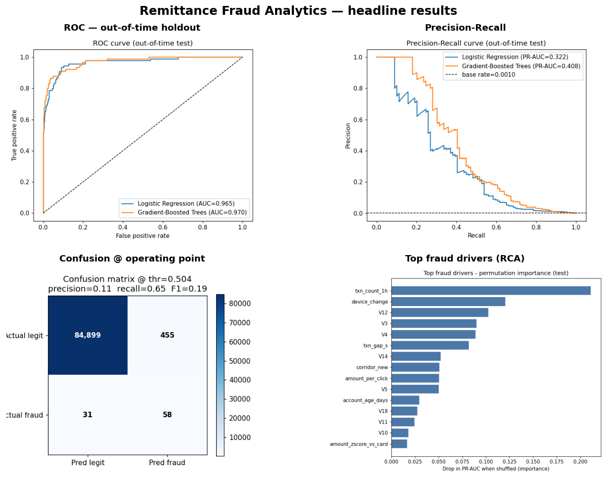
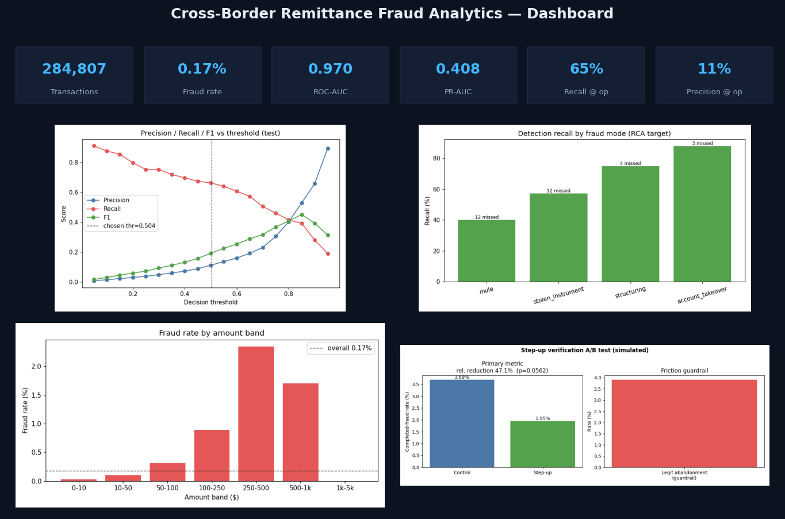
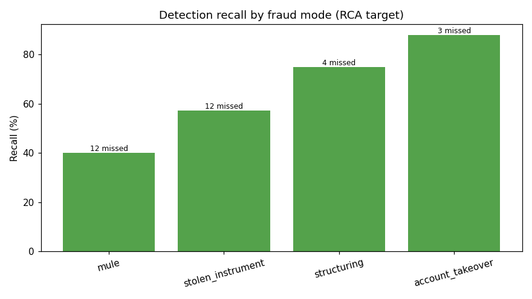
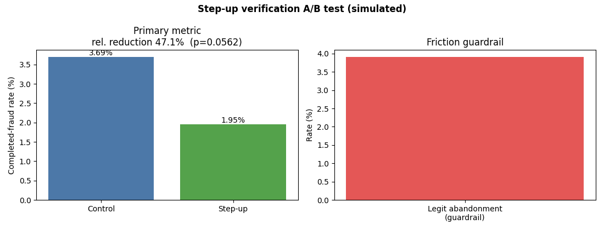

# Cross-Border Remittance Fraud Analytics

**End-to-end fraud detection: feature engineering → a gradient-boosted model with out-of-time evaluation → root-cause analysis → a power-gated A/B test — mapped to a cross-border remittance context.**

### ▶ [**Live demo & dashboard**](https://vijaychamakuri.github.io/remittance-fraud-analytics/) · [Executive summary](reports/executive_summary.md) · [RCA](reports/rca/rca_findings.md) · [A/B test](reports/ab_test/ab_results.md)



---

## Results at a glance

On an **out-of-time holdout** (train on the first 60% of the timeline, tune on the next 10%, evaluate on the untouched final 30% = 85,443 transactions, 89 fraud):

| Model | ROC-AUC | PR-AUC |
|---|---:|---:|
| Logistic Regression (baseline) | 0.965 | 0.322 |
| **Gradient-Boosted Trees (main)** | **0.970** | **0.408** |

Fraud is **0.17% of volume (1 : 580)**, so PR-AUC and recall matter far more than accuracy (a "never fraud" model is 99.83% accurate and useless). The precision/recall dial, with three operating points on the GBT model:

| Operating point | Threshold | Precision | Recall | Use when |
|---|---:|---:|---:|---|
| **Aggressive (chosen)** | 0.50 | 11% | **65%** | a missed fraud costs more than review friction |
| Balanced (F1-optimal) | 0.88 | **57%** | 33% | analyst review capacity is the constraint |
| Wide net | 0.13 | 2% | 87% | backstop behind other checks |

**Why 0.50 is the defensible default (cost rationale):** a missed fraud costs ~the transaction value (**avg ≈ $161** in this data) while a false positive costs ~**$4** of review/step-up friction — an implied **≈ 40 : 1** cost ratio (measured, in [`metrics.json`](reports/evaluation/metrics.json)). At 40:1 it is rational to accept ~40 false alarms to stop one fraud, which is exactly why the cost-minimizing threshold lands at high recall. Change the two cost constants in [`src/config.py`](src/config.py) and the chosen point moves accordingly.

### Live dashboard (fraud KPIs · model performance · RCA · A/B)
[](https://vijaychamakuri.github.io/remittance-fraud-analytics/dashboard.html)

### Root cause & experiment
| Fraud slips through where it looks normal | A tested intervention |
|---|---|
|  |  |
| Top drivers are **1-hour velocity, device change, new-corridor** + anonymized signals. The model catches account-takeover well (88%) but under-catches **mule** fraud (40%) because it hides in normal new-account behavior. | Step-up verification cut completed fraud **3.7% → 2.0% (−47%)**, but the test was underpowered so **p = 0.056 → HOLD, extend the test.** We gate on effect size *and* significance. |

---

## Data & honesty (short version)

This demonstrates fraud-detection **methodology** on **public card-fraud data** (ULB / IEEE-CIS style), mapped onto a remittance context (account takeover, mules, stolen instruments, structuring). It is **not real Remitly data.** Because the build ran offline, the committed results use a **deterministic synthetic dataset** that reproduces the real ULB schema and 0.17% imbalance; the signal was set from plausible priors and **not tuned to a target score** (hence an honest 0.97 AUC, not a fake 0.99). The pipeline runs **unchanged on the real Kaggle dataset** via `python run_pipeline.py --real`. → **Full provenance, mapping, and limitations: [DATA.md](DATA.md).**

---

## Quick start (clone-and-run)

```bash
pip install -r requirements.txt      # or: make install
python run_pipeline.py               # or: make run  — regenerates data + runs everything (~25s)
open dashboard/index.html            # static dashboard, no server needed
```

One command regenerates the deterministic dataset (seed = 42) and runs every stage. Interactive alternative: `streamlit run dashboard/app.py`. Run on the real ULB data: see [DATA.md](DATA.md).

## What's inside (the pipeline)

1. **Ingest + clean** — schema, missing-value handling, class-imbalance report.
2. **EDA** — fraud rate by amount band, time-of-day, device, corridor, merchant category.
3. **Feature engineering** — velocity (1h/24h counts, inter-txn gap), amount anomaly vs. the card's own history, entity aggregates, behavioral/clickstream features, new-device/new-corridor flags — each documented in [`feature_dictionary.md`](reports/eda/feature_dictionary.md).
4. **Model** — Logistic Regression baseline + Gradient-Boosted Trees, imbalance handled with class weighting (chosen over SMOTE: no synthetic rows, leakage-free across the time split).
5. **Evaluation** — precision/recall/F1, ROC-AUC, PR-AUC, confusion matrix, threshold sweep, out-of-time holdout.
6. **Root-cause analysis** — permutation importance (+ optional SHAP) and false-negative decomposition by fraud mode.
7. **A/B test** — step-up verification: hypothesis, power/sample-size, two-proportion z-test, effect-size-gated decision.
8. **Monitoring** — drift (PSI), precision/recall over time, friction guardrails ([note](reports/monitoring_note.md) + [SQL](sql/04_model_monitoring.sql)).
9. **Dashboard + GitHub Pages site** — static HTML, Streamlit, and a published results page.

## Repo structure

```
src/            generate/download data, ingest, eda, features, train, evaluate, rca, ab_test, build_dashboard, build_site
sql/            BigQuery-style versions of fraud-rate, segment, velocity/entity, and monitoring queries
reports/        eda/ evaluation/ rca/ ab_test/ figures + JSON, monitoring_note.md, executive_summary.md
dashboard/      index.html (static) + app.py (Streamlit)
docs/           GitHub Pages: index.html (results landing) + dashboard.html + assets
data/           sample_1000.csv preview (full data regenerated deterministically)
models/         trained models + predictions (regenerated)
run_pipeline.py one command · requirements.txt · Makefile · DATA.md
```

## Tools (mapped to the role)
Python (pandas, scikit-learn, scipy, matplotlib) · **SQL / BigQuery-style** models of the key steps in `sql/` · statistical experimentation (power + two-proportion z-test) · dashboards (static HTML + Streamlit) · translation of every result into plain-English recommendations for Product & Compliance.

MIT licensed. Full data provenance and honest limitations in **[DATA.md](DATA.md)**.
